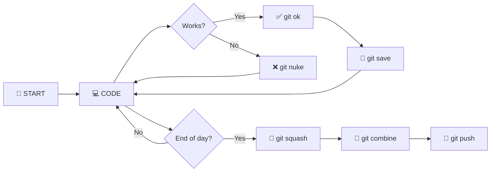
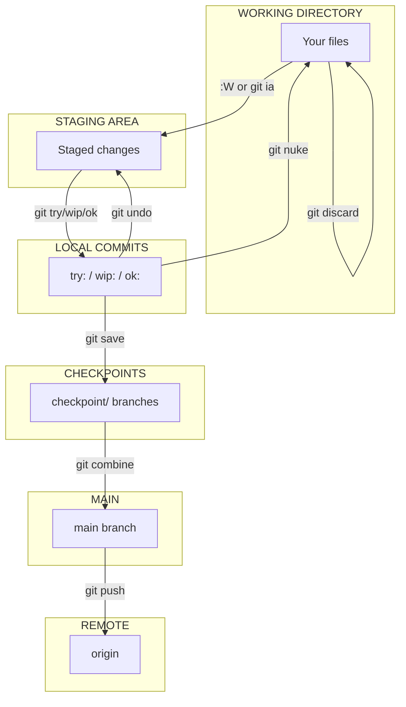
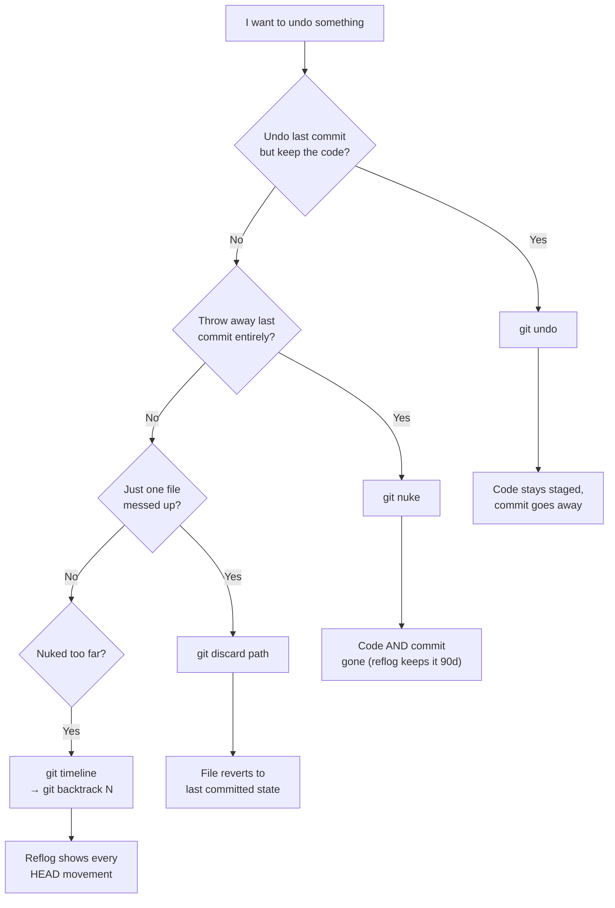
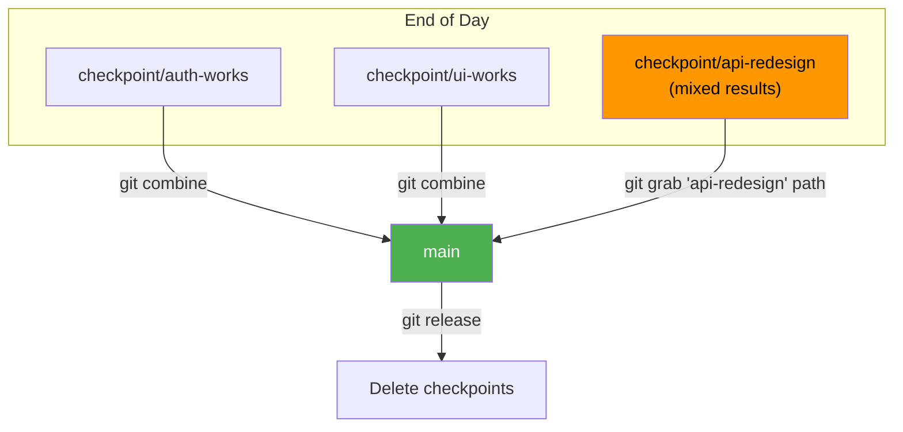
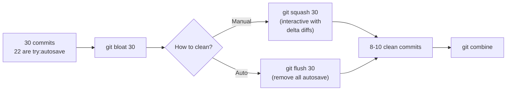

# Cheatsheet

* Generate PDF using `mmm`

## DAILY WORKFLOW AT A GLANCE



---

## HOW DATA MOVES



---

## UNDO FLOW — WHICH TO USE WHEN



---

## ASSEMBLY — COMBINING CHECKPOINTS



---

## DEBLOAT — CLEANING UP BEFORE ASSEMBLY



---

## COMMITTING

| Command | Purpose | Commit Prefix |
|---|---|---|
| `:W` | Neovim: save + autosave commit | `try:autosave` |
| `:w` | Neovim: regular save, no git | — |
| `git try "msg"` | Experimental, might revert | `try:` |
| `git wip "msg"` | Work in progress | `wip:` |
| `git ok "msg"` | This state works | `ok:` |
| `git ia` | Interactive add — pick hunks | — |

---

## COMMIT PREFIX GUIDE

| Prefix | Keep or squash? | When |
|---|---|---|
| `try:autosave` | Squash or flush | From `:W`, noise |
| `try:` | Squash if worked, drop if didn't | Experiments |
| `wip:` | Squash into the `ok:` that follows | In-progress work |
| `ok:` | **Keep always** | Working states |
| `fix:` | **Keep always** | Bug fixes |

---

## CHECKPOINTING

| Command | Purpose |
|---|---|
| `git save "name"` | Create checkpoint branch (stay on current) |
| `git saveas "name"` | Create checkpoint branch + switch to it |
| `git checkpoints` | List all checkpoint branches |

---

## UNDO

| Command | Purpose |
|---|---|
| `git undo` | Undo last commit, keep changes staged |
| `git nuke` | Undo last commit, throw away changes |
| `git discard path` | Restore file to last committed state |

---

## RECOVERY

| Command | Purpose |
|---|---|
| `git timeline` | Show recent HEAD movements (reflog) |
| `git backtrack N` | Jump to reflog entry N |

---

## ASSEMBLY

| Command | Purpose |
|---|---|
| `git combine "name"` | Merge checkpoint into current branch |
| `git grab "name" path` | Grab a file from a checkpoint |
| `git pick abc123` | Cherry-pick a specific commit |

---

## DEBLOAT

| Command | Purpose |
|---|---|
| `git bloat 30` | Show autosave count in last 30 commits |
| `git squash 30` | Interactive rebase — delta shows diffs |
| `git autodebloat 30` | Interactive rebase with autosquash |
| `git flush 30` | Remove ALL try:autosave, keep meaningful |

---

## VISIBILITY

| Command | Purpose |
|---|---|
| `git unsaved` | Unstaged changes (delta rendered) |
| `git staged` | Staged changes (delta rendered) |
| `git last` | Diff of last commit (delta rendered) |
| `git trail` | Last 20 commits, one line each |
| `git today` | Today's commits |
| `git cdiff "a" "b"` | Diff between two checkpoints |

---

## CLEANUP

| Command | Purpose |
|---|---|
| `git release "name"` | Delete a checkpoint branch |
| `git releaseall` | Delete ALL checkpoint branches |

---

## CONFLICT RESOLUTION

During `git combine`, if conflicts appear:

| Action | How |
|---|---|
| Resolve manually | Edit file, find `<<<<<<<` markers, pick what you want |
| Keep yours | `git checkout --ours path` |
| Keep theirs | `git checkout --theirs path` |
| Cancel entirely | `git merge --abort` |

---

## EXAMPLE DAY

```zsh
$ git save "morning-base"
  Saved checkpoint/morning-base at a1b2c3d

  ...code... :W ...code... :W ...code... :W

$ git ok "auth flow done"
$ git save "auth-works"
  Saved checkpoint/auth-works at e4f5g6h

  ...code... :W ...code... :W

$ git try "redis caching"
  ...doesn't work...
$ git nuke

$ git try "in-memory cache"
  ...works...
$ git ok "caching works"
$ git save "cache-works"

$ git bloat 40
  22 of 40 commits are try:autosave (55%)

$ git squash 40
  ...interactive rebase with delta diffs...
  ...mark try:autosave as fixup or drop...

$ git checkout main
$ git combine "auth-works"
$ git combine "cache-works"

$ git releaseall
$ git push
```

---

## KEY RULES

* **Commit often.** Nobody sees your history until you push.
* **`git save` is free.** Branches cost nothing. Make lots of checkpoints.
* **`git nuke` is safe.** The reflog keeps everything for ~90 days.
* **Debloat before assemble.** Squash the noise, then combine the clean history.
* **`ok:` commits are sacred.** Everything else is disposable.
* **Never flush/squash after push.** These rewrite local history.
* **`git timeline` is your safety net.** Any mistake is recoverable.

# References

* Cheatsheet vibed by Kagi-Quick
